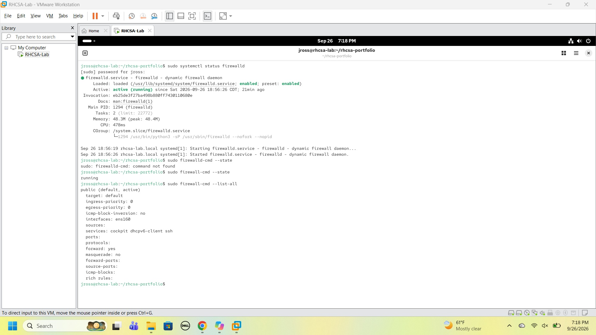
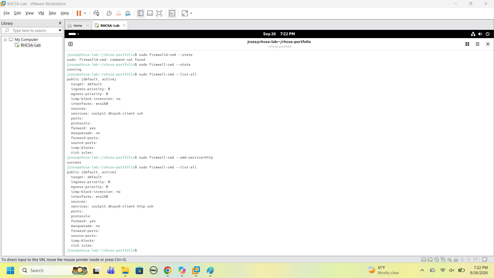
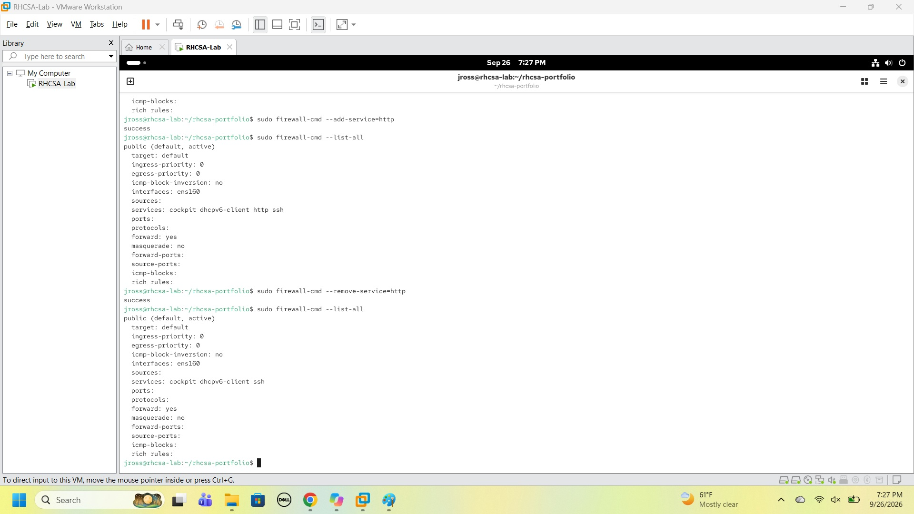
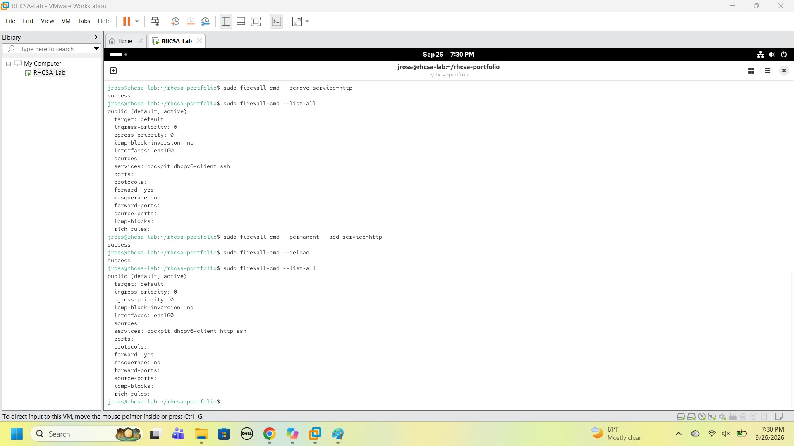
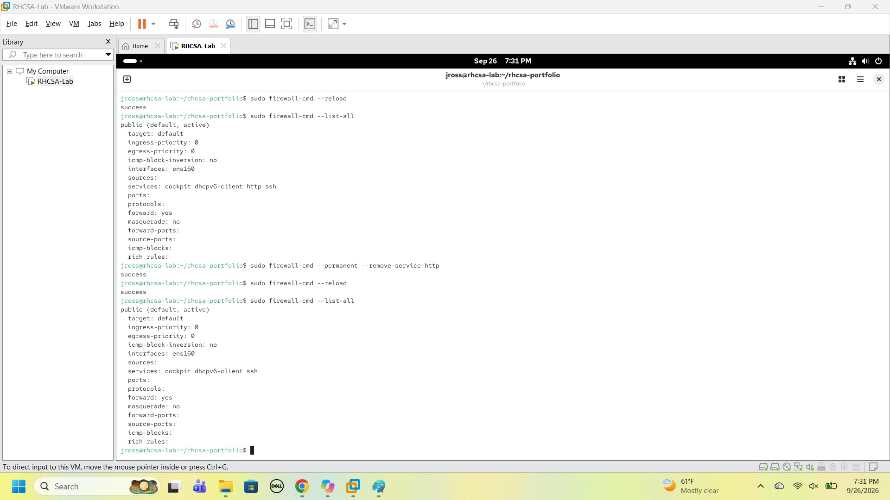

# Lab 09 — Firewalld

## Objective

Demonstrate basic firewall administration using firewalld, including viewing firewall status, inspecting rules, adding services, removing services, and understanding the difference between runtime and permanent firewall configuration.

## Environment

- OS: Rocky Linux
- Hostname: rhcsa-lab.local
- Primary User: jross
- Hypervisor: VMware Workstation

## Concepts Covered

| Command | Purpose |
|----------|----------|
| systemctl status firewalld | Verify firewall service |
| firewall-cmd --state | Check firewall state |
| firewall-cmd --list-all | View firewall configuration |
| firewall-cmd --add-service | Add runtime service |
| firewall-cmd --remove-service | Remove runtime service |
| firewall-cmd --permanent | Make changes persistent |
| firewall-cmd --reload | Apply permanent changes |

---

## Understanding Firewalld

A firewall controls network traffic entering and leaving a system.

Think of the firewall as:

```text
Security Guard
```

The firewall decides:

```text
Who is allowed in?
Who is blocked?
```

---

## Verify Firewalld Service

Command:

```bash
sudo systemctl status firewalld
```

Observation:

```text
Active: active (running)
Enabled: enabled
```

This confirmed:

- Firewalld was running
- Firewalld starts automatically at boot

---

## Verify Firewall State

Command:

```bash
sudo firewall-cmd --state
```

Output:

```text
running
```

Observation:

The firewall service was actively managing network access.

---

## View Current Configuration

Command:

```bash
sudo firewall-cmd --list-all
```

Output included:

```text
public (active)
services: cockpit dhcpv6-client ssh
```



Observation:

The active zone was:

```text
public
```

Allowed services included:

- SSH
- Cockpit
- DHCPv6 Client

---

## Add Runtime Service

Add HTTP access temporarily:

```bash
sudo firewall-cmd --add-service=http
```

Result:

```text
success
```

Verify:

```bash
sudo firewall-cmd --list-all
```

Output:

```text
services: cockpit dhcpv6-client http ssh
```



Observation:

HTTP access was added to the running firewall configuration.

---

## Remove Runtime Service

Command:

```bash
sudo firewall-cmd --remove-service=http
```

Result:

```text
success
```

Verify:

```bash
sudo firewall-cmd --list-all
```

Output no longer contained:

```text
http
```



Observation:

The runtime rule was removed successfully.

---

## Add Permanent Service

Command:

```bash
sudo firewall-cmd --permanent --add-service=http
```

Result:

```text
success
```

Apply configuration:

```bash
sudo firewall-cmd --reload
```

Verify:

```bash
sudo firewall-cmd --list-all
```

Output:

```text
services: cockpit dhcpv6-client http ssh
```



Observation:

HTTP became part of the permanent firewall configuration.

---

## Remove Permanent Service

Command:

```bash
sudo firewall-cmd --permanent --remove-service=http
```

Apply configuration:

```bash
sudo firewall-cmd --reload
```

Verify:

```bash
sudo firewall-cmd --list-all
```

Output returned to:

```text
services: cockpit dhcpv6-client ssh
```



Observation:

The permanent HTTP rule was removed successfully.

---

## Runtime vs Permanent

One of the most important firewalld concepts:

```text
Runtime
=
Current firewall configuration
```

```text
Permanent
=
Configuration retained after reloads and reboots
```

Examples:

```bash
firewall-cmd --add-service=http
```

Runtime only.

```bash
firewall-cmd --permanent --add-service=http
```

Persistent configuration.

---

## Key Lessons Learned

- Firewalld manages network access.
- Zones determine firewall policy.
- Services represent allowed network traffic.
- Runtime rules affect the current session.
- Permanent rules survive reloads and reboots.
- Configuration changes should always be verified.

---

## Verification Checklist

- [x] Verified firewall service status
- [x] Verified firewall operational state
- [x] Viewed active firewall configuration
- [x] Added runtime HTTP service
- [x] Removed runtime HTTP service
- [x] Added permanent HTTP service
- [x] Reloaded firewall configuration
- [x] Removed permanent HTTP service
- [x] Verified final firewall configuration

---

## RHCSA Notes

Useful firewalld commands:

```bash
firewall-cmd --state

firewall-cmd --list-all

firewall-cmd --add-service=http

firewall-cmd --remove-service=http

firewall-cmd --permanent --add-service=http

firewall-cmd --permanent --remove-service=http

firewall-cmd --reload
```

Most important concept:

```text
Runtime Rules
≠
Permanent Rules
```
