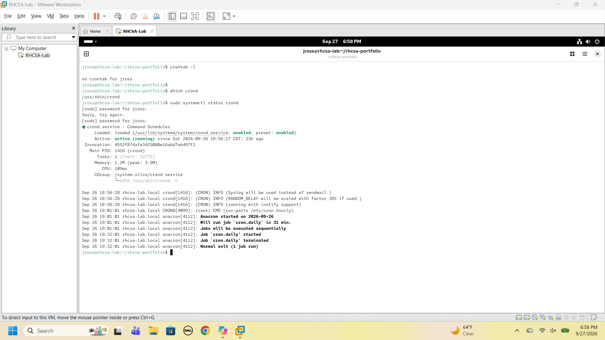
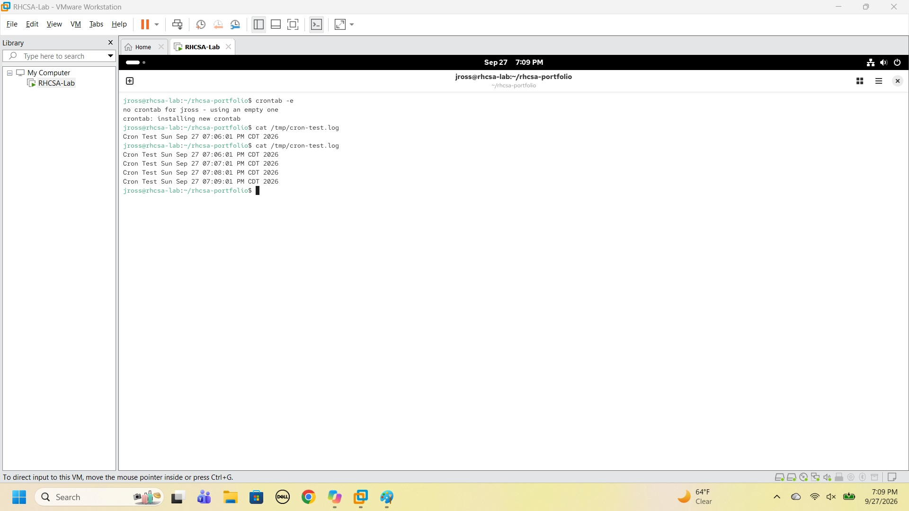
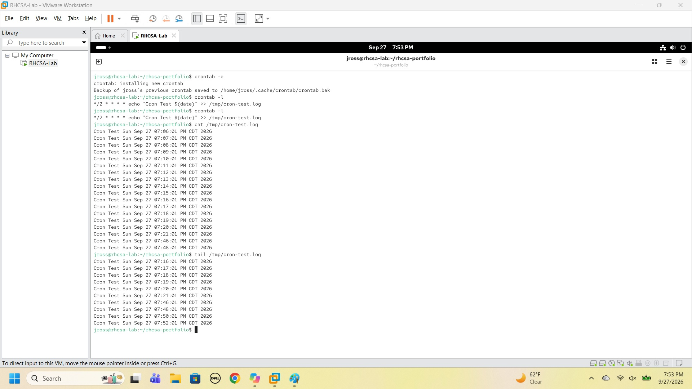
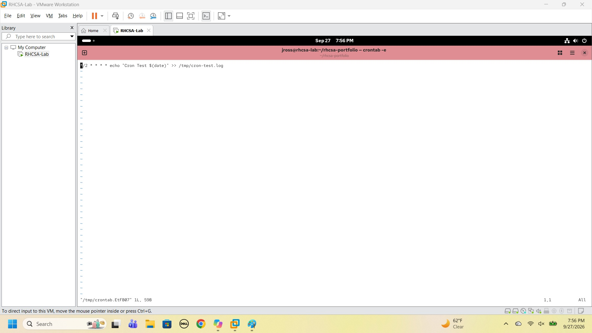
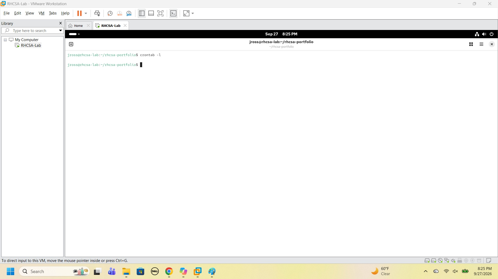

# Lab 10 — Scheduled Tasks (Cron)

## Objective

Demonstrate Linux task automation using cron by creating, verifying, modifying, and removing scheduled tasks.

## Environment

- OS: Rocky Linux
- Hostname: rhcsa-lab.local
- Primary User: jross
- Hypervisor: VMware Workstation

## Concepts Covered

| Command | Purpose |
|----------|----------|
| crontab -l | List scheduled jobs |
| crontab -e | Create or edit scheduled jobs |
| which crond | Confirm the cron scheduler is installed |
| systemctl status crond | Verify cron service |
| cat | View cron output |
| tail | View latest log entries |

---

## Understanding Cron

Cron is the Linux scheduling service.

Think of cron as:

```text
Linux Alarm Clock
```

Cron allows tasks to run automatically at specified times.

Examples:

- Backups
- Log cleanup
- Report generation
- System maintenance

---

## Verify Existing Jobs and Cron Service

Check for existing scheduled jobs:

```bash
crontab -l
```

Output:

```text
no crontab for jross
```

Confirm the scheduler is installed:

```bash
which crond
```

Output:

```text
/usr/sbin/crond
```

Verify the service:

```bash
sudo systemctl status crond
```

Observation:

```text
Active: active (running)
Enabled: enabled
```



The scheduler was installed and running, and no scheduled jobs existed yet.

---

## Create First Scheduled Task

Edit user crontab (opens in vim on this system):

```bash
crontab -e
```

Added:

```text
* * * * * echo "Cron Test $(date)" >> /tmp/cron-test.log
```

Meaning:

```text
Every minute
↓
Write current date/time
↓
Append to log file
```

Save and exit (`:wq` in vim).

Observation:

```text
crontab: installing new crontab
```

---

## Verify Cron Execution

Check output:

```bash
cat /tmp/cron-test.log
```

Result:

```text
Cron Test Sun Sep 27 07:06:01 PM CDT 2026
Cron Test Sun Sep 27 07:07:01 PM CDT 2026
Cron Test Sun Sep 27 07:08:01 PM CDT 2026
Cron Test Sun Sep 27 07:09:01 PM CDT 2026
```



Observation:

The task executed successfully, adding a new entry every minute.

---

## Modify Schedule

Edit:

```bash
crontab -e
```

Changed:

```text
* * * * *
```

to:

```text
*/2 * * * *
```

Result:

```text
Every 2 minutes
```

New entry:

```text
*/2 * * * * echo "Cron Test $(date)" >> /tmp/cron-test.log
```


Observation:

Cron saved a backup of the previous crontab automatically:

```text
Backup of jross's previous crontab saved to /home/jross/.cache/crontab/crontab.bak
```

---

## Verify Updated Schedule

Check configuration:

```bash
crontab -l
```

Verify log:

```bash
tail /tmp/cron-test.log
```

Observed timestamps:

```text
07:46
07:48
07:50
07:52
```



Observation:

The task now executed every two minutes.

---

## Remove Scheduled Task

Edit:

```bash
crontab -e
```

Delete the cron entry.



Save and exit with `:wq`.


Verify:

```bash
crontab -l
```

Result:

```text
(no output — crontab is empty)
```



Observation:

The scheduled task was successfully removed.

---

## Understanding Cron Time Fields

Cron expressions use five fields:

```text
Minute
Hour
Day
Month
Weekday
```

Example:

```text
* * * * *
```

Means:

```text
Every minute
```

Example:

```text
*/2 * * * *
```

Means:

```text
Every 2 minutes
```

---

## Key Lessons Learned

- Cron automates recurring tasks.
- `crond` performs scheduled work.
- `crontab -e` modifies scheduled jobs.
- `crontab -l` displays scheduled jobs (that's a lowercase L, not the number 1).
- Cron entries should always be verified.
- Scheduled tasks can be modified without restarting the service.
- `crontab -e` saves a backup of the previous crontab.
- Jobs should be removed when no longer needed.

---

## Verification Checklist

- [x] Verified cron service
- [x] Viewed existing cron jobs
- [x] Created scheduled task
- [x] Verified execution
- [x] Modified task schedule
- [x] Verified updated schedule
- [x] Removed scheduled task
- [x] Verified cleanup

---

## RHCSA Notes

Useful cron commands:

```bash
crontab -l

crontab -e

systemctl status crond
```

Most important concept:

```text
Create
↓
Verify
↓
Modify
↓
Verify
↓
Remove
```
